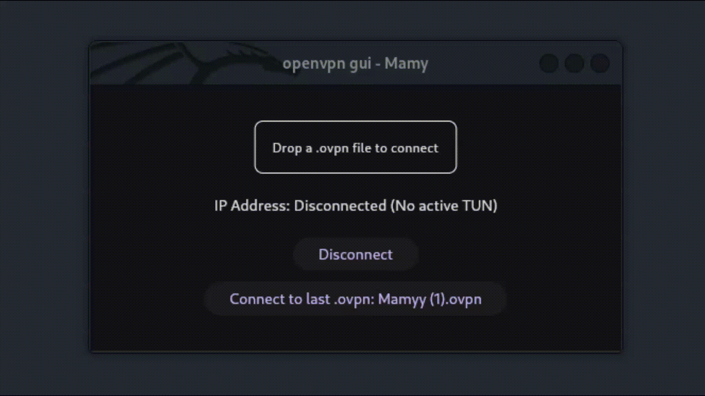

# OpenVPN GUI Client

A simple and user-friendly GUI for managing OpenVPN connections.

This project was developed in a short amount of time, so it’s not perfect. I welcome all [contributions](#-Contributing) to help improve it!

---

## 🚀 Features

- **Easy Connection Management**: Connect, disconnect, and switch profiles with just a few clicks.
- **Profile Handling**: Load your `.ovpn` files seamlessly.
- **Minimal Design**: A clean, simple interface to get things done quickly.
- **Linux-First**: Currently, this tool is developed and tested only for Linux systems.  

> **Note**: While the project is focused on Linux, it can be built for Windows and macOS with some modifications. Contributions to expand compatibility are welcome!

---

## 🌟 Why This Project?

I built this tool as a fun personal project to streamline my workflow while solving CTF challenges. While it's not intended for professional use, I hope it might also be helpful to others.

Feel free to star ⭐ the repo if you find it useful!

---

## 🛠️ Installation

soon

---

### 🤝 Contributing

Contributions are welcome!
Whether it's fixing bugs, suggesting features, or improving the documentation, I'd love your input. This is my first open-source project, and I'm excited to collaborate and learn with the community.

How to Contribute

1. Fork the repository.

2. Create your feature branch:

`git checkout -b feature/NewFeature`

4. Commit your changes:

`git commit -m 'Add some NewFeature'`

5. Push to the branch:

`git push origin feature/NewFeature`

6. Open a pull request.

---

### 📜 License
This project is licensed under the [GPL-3.0 License](LICENSE).
